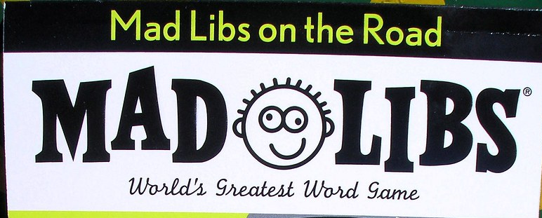

## Playing Mad Libs

Throughout our everyday lives we encounter a variety of problems that add to the never-ending stress of life. We usually tackle these problems one-by-one with a different solution for each problem, but what if we were able to solve a group of problems with by just filling in the blanks in a reusable solution. This is where design patterns come in. Design patterns are template solutions that are applicable to a variety of problems with similar traits. I like to think about it like playing Mad Libs. You have a set story, but there are blanks where you can fill in a specified noun, verb, adjective, or adverb. Depending on the word of your choice, the story can be funny, scary, happy, you name it. The story transforms to fit the feelings and message you are conveying. When using design patterns in software engineering we fill in the blanks with objects or relationships to accomplish the task at hand. Just like how Mad Libs are curated by professionals to make sense regardless of what word you choose, experts refine design patterns so we are able to solve common, reoccuring problems with the best solution.

### Mad Libs in Everyday Life
We incorporate design patterns into our everyday life without even realizing it. For example, when go to sleep we are taught that going to sleep is easiest when you're lying down with a pillow under your head and a blanket covering you up. This is a simple design pattern that has been refined throughout the years to perfect our sleep and give the general population a decent sleep. As each person varies, they adjust this general pattern for sleep to fit their needs. They adjust what kind of bed or pillow to improve their sleep, but they know they will need to start off with a bed and a pillow. This is similar to the thinking with design patterns in software engineering, where we know we need use the basic template or idea that has been refined by experts to help you solve the problem.

## Budget Munchies
Budget Munchies is a new website application that I am working on with three of my classmates. Our goal is to create site that allows UH Manoa students to find and share cheap and easy recipes. I saw this project as a perfect opportunity to practice utilizing design patterns in software engineering. At first I'll admit that it was a bit tough to catch on because everything was so new to me, but I thought about it like playing Mad Libs and filling in the blanks while using the meteor application template given by our professor. I then started to see how everything was connecting together, so it was helpful to have something to build off of. One of the design patterns that helped me out the most was the Singleton design pattern because I was able to make an instance of the Recipe class and import that instance to be used all over my code, so I didn't have to keep on recreating instances and figure out how to connect all of them.

## Still Learning
Giving Mad Lib design patterns a try in my software engineering has helped me create a solid foundation to build my knowledge off of, so I can save time and soar to greater heights!
