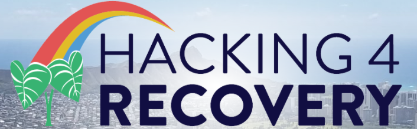
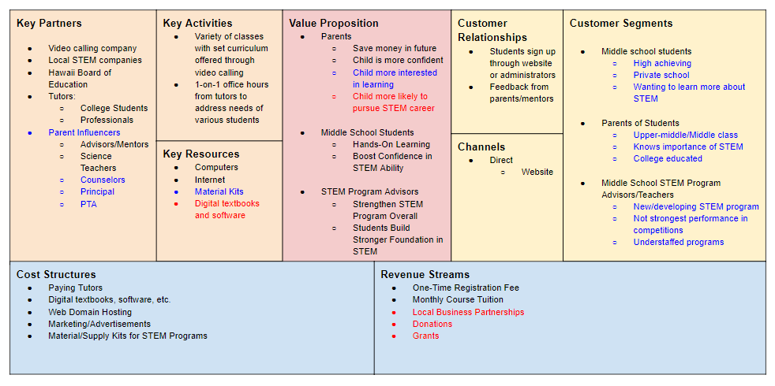

Hacking 4 Recovery is an innovative, online bootcamp where teams were invited to create solutions to help diversify and grow Hawaii's economy after the negative impact from the COVID-19 pandemic.  For 5 days from 4 to 7 pm, an online meeting was held with all of the mentors and participants where we pitched and improved our innovation each day.  My team worked with the idea of new models of education because we saw a gap between the STEM education in the mainland USA and Hawaii.  We wanted to bridge the gap and create a platform that gives students the chance to be able to experience hands-on STEM learning during the COVID-19 pandemic.  We created Spark Education to help students cooperate with other students across the island and create connections during a time where it is difficult to do both team and hands-on learning.

Here is one of the versions of our business model canvas.

For this project, I was a co-founder and the chief operations officer who was responsible for various tasks such as: writing the reports, collecting data, making presentations, presenting, holding meetings, and formulating our idea.  I started by working with my teammates on developing our idea and working out all of the possible pitfalls.  I continuously worked on improving our idea and updating our pitch.  As we solidified our foundation and basics of the idea, I worked on the curriculum.  I worked with my teammates to decided what was going to be taught, how long each class is, and the activities we were doing in correspondence with the topic of the week.

From this project I experienced a snipet of startups and entrepreneurship. I learned about the dedication and time it takes to follow through with an idea and turn it into reality.  I learned the lean starup techniques where we were taught the business aspects of innovation and gather information about our customers.

You can learn more at [Spark Education Website](https://alez12540.wixsite.com/sparkeducation).
Check out our Linkedin at [Spark Education Linkedin](https://www.linkedin.com/company/spark-hawaii/).

