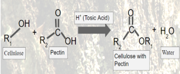
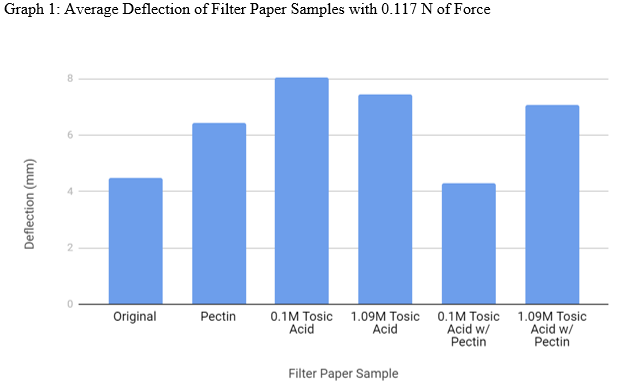
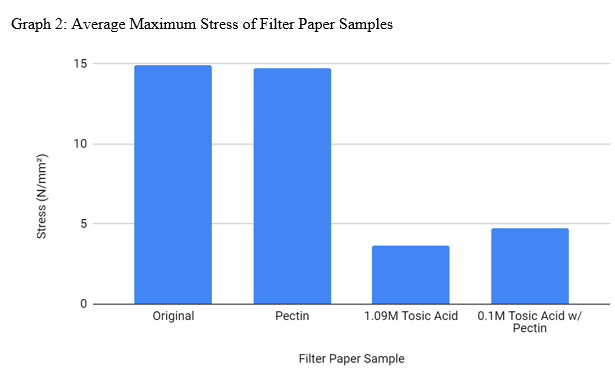
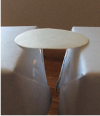

I competed in Hawaii State Science Fair with this project where various students come together to share their latest innovations and discoveries.  I completed a project involving a series of trials and attempts to create a stronger bond in cellulose with pectin using esterification.  My goal was to create a high strength building material that is safe for the environment and made out of sustainable and renewable resources.

Cellulose holds great potential for building materials because it is a strong, abundant, and organic polymer.  In plants, pectin is what helps hold and strengthen the bond between the cellulose molecules.  By using esterification, a chemical reaction involcing an alcohol, carboxylic acid, and catalyst acid, my teammate and I attempted to strengthen the cellulose cross-links.

We utilized filter paper as our source of cellulose and soaked it in a pectin solution where we later esterified it with tosic acid.  The strength was tested using deflection data from the stiffness of the paper.

From this project, I gained time management, presentation, and critical thinking skills.  Throughout the experiments, I had to think about what we could improve on and why it wasn't working.  I consistently thought of both new ideas and our pitfalls to better improve each test we carried out.
