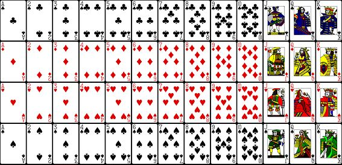

My project was for my AP CS class in my junior year of high school.  It was a simple card game where the user has to match a pair of cards that equals 13.  If the user has cards left at the end of the game and they don't equal 13, the user loses.  If all of the cards are cleared, the user wins.

For this project I coded the functions that run the game.  I coded the backend code such as, checking that the cards selected where equal to 13, creating the card objects, and keeping track of the cards displayed.  I utilized blueJ for my IDE and the teacher supplied the card pictures and GUIs.

I learned that I have to think about every possibility when I bring in user interface.  I have to think of all of the possible mistakes or solutions that come out when they make a certain choice.  I gained a better grasp of object oriented programming from this project because I had to plan out what things needed to be objects and what needed to be classes.  I also needed to plan out the inheritance and which were subclasses.

Although this was a rather simple project, this was my turning point that made me realize I wanted to major in computer science. The thinking and problem solving I did during this project brought me joy because I was able to test out different methods of solving a problem and find the best one.
